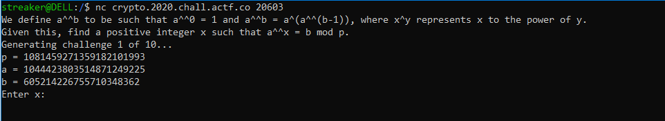
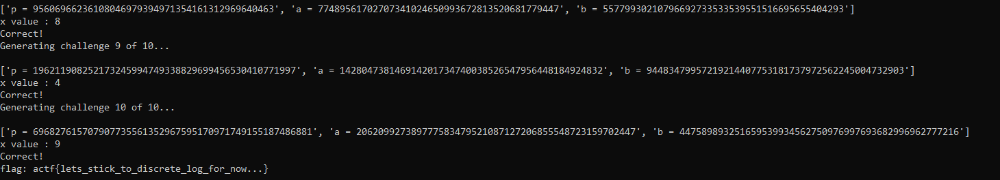

Hey guys back with another set of few writeups.


# **CRYPTO**

## Discrete Superlog-:
> description:

You've heard of discrete log...now get ready for the discrete superlog.

`Server 1: nc crypto.2020.chall.actf.co 20603`

`Server 2: nc 3.234.224.95 20603`

`Server 3: nc 3.228.7.55 20603`

Author: lamchcl

### Solution: 

When we connect to the server,we were greeted with this



So from the description we know we need to do something with *discrete log* . But then analyzing this opertor **^^** , we found that this is something we known as [Tetration](https://en.wikipedia.org/wiki/Tetration).
So in [Discrete log](https://en.wikipedia.org/wiki/Discrete_logarithm) , for a function (a^x)=b mod p we need to find x by using baby-step giant-step method. But here the things are different and as they *Discrete superlog*.


So let's brute the value of x , in simple words we check for each value of x.
Having [Fermat's Little Theorem](https://en.wikipedia.org/wiki/Fermat%27s_little_theorem) in mind, I know pow(a,x,p)=pow(a,x mod(phi(p)),p ) where phi() is euler totient function.

So whenever the power raised is getting bigger we will make it smaller by taking modulo over phi(p).Using simple recursion will help it. 

##### Termination:
The program will terminate when finally the power raised is getting modulo 1 or we would say phi(phi(phi....(p)....))=1.
After then the answer will be same for every x.

```
def tet(a,x,p):
    if p==1 or x==0:
        return 1 
    phi=totient(p)
    return pow(a,tet(a,x-1,phi),p)
```

After testing over some values:
```
>>> tet(5,1,37)
5
>>> tet(5,2,37)
17
>>> tet(5,3,37)
35
>>> tet(5,4,37)
35
>>> tet(5,5,37)
35
```


Here is our final script:

```python
from pwn import *
from sympy.ntheory import totient

def tet(a,x,p):
    if p==1 or x==0:
        return 1 
    phi=totient(p)
    return pow(a,tet(a,x-1,phi),p)

r=remote("crypto.2020.chall.actf.co",20603)
level=1

while 1:
    if level>10:
        print(r.recv())
        exit()
    print(r.recvuntil("...\n"))
    details=r.recv()
    values=details.split("\n")[:-1]
    print(values)
    p=int(values[0].split()[-1])
    a=int(values[1].split()[-1])
    b=int(values[2].split()[-1])
    x=0
    while 1:
        c=tet(a,x,p)
        if c == b:
            break
        x+=1
    print("x value : "  + str( x ) )
    r.sendline(str(x))
    level+=1

r.close()
```

We got [this response](assets/discsuperlog_response.txt) for the above [script](assets/dec_disclog.py):



Here is our flag:`actf{lets_stick_to_discrete_log_for_now...}`

