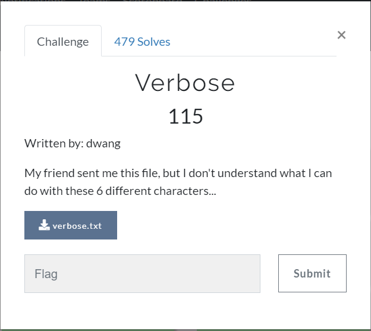
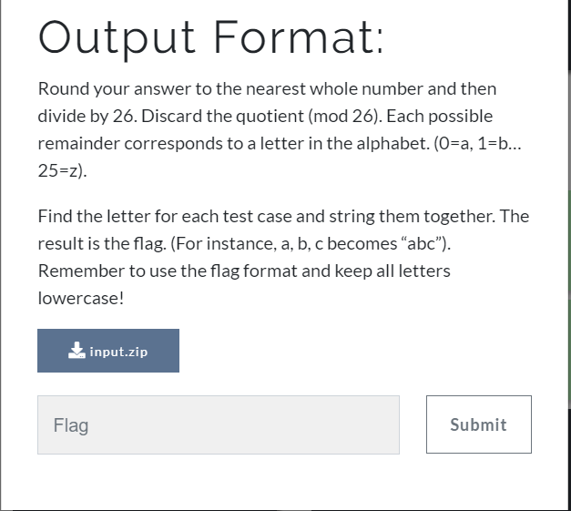
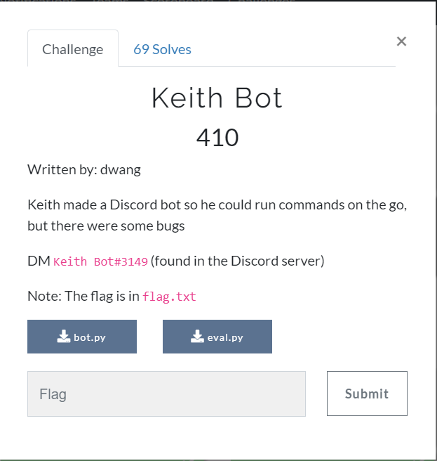
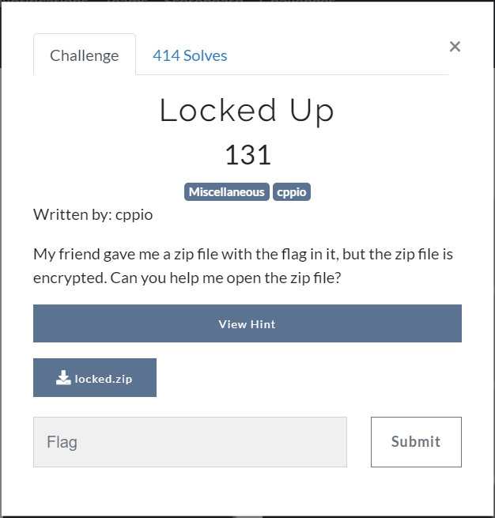

A High School CTF event.

We tried to solve challenges as much as possible we can and as a reult we secured 23 position globally.

Challenge  Name | Points | Flag
------------ | ------------- | ---------------
 | |
 | |
 | |
 | |
 | |
 | |
 | |
 | |
 | |
 | |
 | |
 | |
 | |
 | |
 | |
 | |
 | |
 | |
 | |
 | |
 | |
 | |
 | |
 | |
 | |
 | |
 | |
 | |
 | |
 | |
 | |
 | |
 | |
 | |
 | |
 | |
 | |
 | |
 | |
 | |
 | |
 | |
 | |
 | |
 | |
 | |
 | |
 | |

I will try to discuss all the solutions here:

# MISC
## Verbose-:
> description: 

## Hidden Flag-:
> description: 

## 64+Word -:
> description: 

## Broken gps-:
> description: 

## Keith_Bot-:
> description: 

## Locked_up-:
> description: 

## RealReversal-:
> description: 

