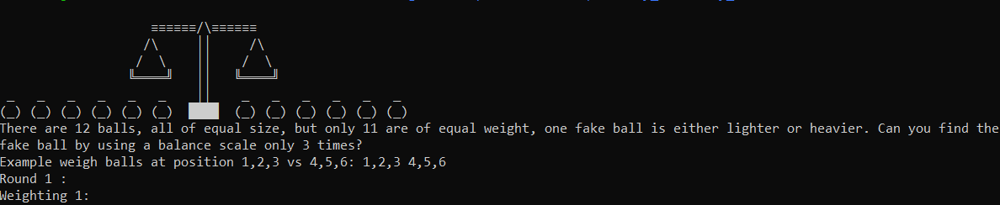

ISIDTU CTF -> https://ctf.isitdtu.com


Enjoyed the CTF but we tried to give our best as there was limited time. Many challenges solved by us after the contest finished.

I will share some of the writeups that I found interesting.


# **PROGRAMMING**

## BALLS -:

Description: 


>There are 12 balls, all of equal size, but only 11 are of equal weight, one fake ball is either lighter or heavier. Can you find the fake ball by using a balance scale only 3 times?

>nc 34.68.81.63 6666


### Solution:
 
While reading the description it looks like some brain teaser. I quickly googled it and I found this link http://www.mytechinterviews.com/12-identical-balls-problem . Then it's easier after it just we need to send the arguments only.



Here's the [script](balls.py)


```python
from pwn import *
import sys

outs=['The left is lighter than the right','Both are equally heavy','The left is heavier than the right']
r = remote('34.68.81.63',6666)
fake='1 2'

def res(num):
	print(num)
	print(r.recvline())
	r.sendline(str(num))
	print('result->' + r.recvline())
 
 
while(1):
	try:
		s = r.recvline()
	except EOFError:
		r.interactive()
	print(s)
	if 'Round' in s:
		print(r.recvuntil('Weighting 1: '))
		r.sendline('1,2,3,4 5,6,7,8')
		output = r.recvline()
		print(output)
		print(r.recvuntil('Weighting 2: '))
  
		if outs[0] in output:
			r.sendline('5,6,1 7,2,9')
			output2 = r.recvline()
			print(output2)
			print(r.recvuntil('Weighting 3: '))
			if outs[0] in output2:
				r.sendline('1 9')
				output3 = r.recvline()
				print(output3)
				if outs[1] in output3:
					res(7)
				if outs[0] in output3:
					res(1)
				if outs[2] in output3:
					res(1)
			if outs[1] in output2:
				r.sendline('3 4')
				output3 = r.recvline()
				print(output3)
				if outs[1] in output3:
					res(8)
				if outs[0] in output3:
					res(3)
				if outs[2] in output3:
					res(4)
			if outs[2] in output2:
				r.sendline('5 6')
				output3 = r.recvline()
				print(output3)
				if outs[1] in output3:
					res(2)
				if outs[0] in output3:
					res(6)
				if outs[2] in output3:
					res(5)


		if outs[1] in output:
			r.sendline('8,9 10,11')
			output2 = r.recvline()
			print(output2)
			print(r.recvuntil('Weighting 3: '))
			if outs[0] in output2:
				r.sendline('10 11')
				output3 = r.recvline()
				print(output3)
				if outs[1] in output3:
					res(9)
				if outs[0] in output3:
					res(11)
				if outs[2] in output3:
					res(10)
			if outs[1] in output2:
				r.sendline(fake)
				output3 = r.recvline()
				print(output3)
				res(12)
			if outs[2] in output2:
				r.sendline('10 11')
				output3 = r.recvline()
				print(output3)
				if outs[1] in output3:
					res(9)
				if outs[0] in output3:
					res(10)
				if outs[2] in output3:
					res(11)


		if outs[2] in output:
			r.sendline('1,2,5 3,6,9')
			output2 = r.recvline()
			print(output2)
			print(r.recvuntil('Weighting 3: '))
			if outs[0] in output2:
				r.sendline('5 9')
				output3 = r.recvline()
				print(output3)
				if outs[1] in output3:
					res(3)
				if outs[0] in output3:
					res(5)
				if outs[2] in output3:
					res(9)
			if outs[1] in output2:
				r.sendline('7 8')
				output3 = r.recvline()
				print(output3)
				if outs[1] in output3:
					res(4)
				if outs[0] in output3:
					res(7)
				if outs[2] in output3:
					res(8)
			if outs[2] in output2:
				r.sendline('1 2')
				output3 = r.recvline()
				print(output3)
				if outs[1] in output3:
					res(6)
				if outs[0] in output3:
					res(2)
				if outs[2] in output3:
					res(1)

```
We get result like this
```
Round 50 :

Weighting 1:
The left is heavier than the right

Weighting 2:
Both are equally heavy

Weighting 3:
Both are equally heavy

4
The fake ball is :

result->EXACTLY, The fake ball is 4
```

That's a long script I feel same as well but it was easier to understand for me.:smiley: 
Anyways here's the flag `ISITDTU{y0u_hav3_200iq!!!!}`

