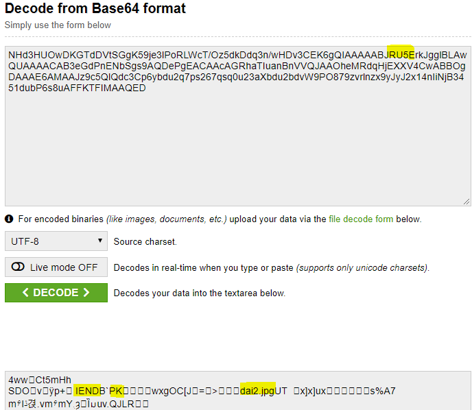
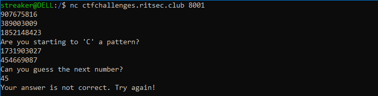
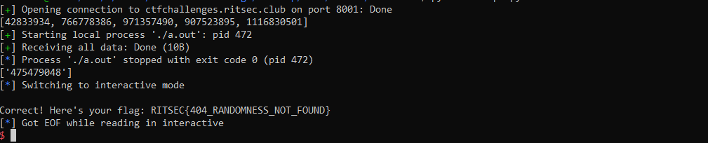
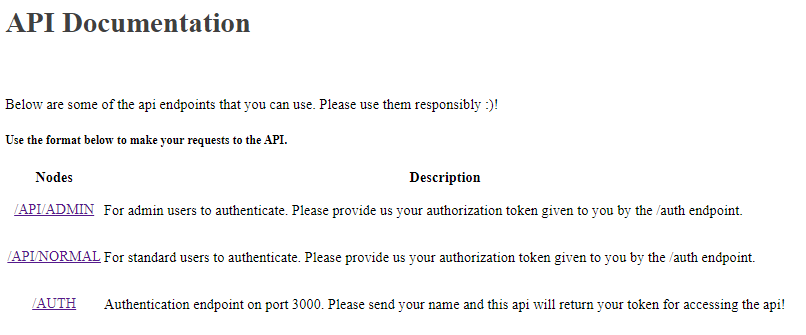
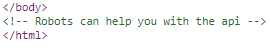

A jeopardy styled CTF : RITSEC CTF 2019 is a security-focused competition


We tried to solve challenges as much as possible we can and as a result we secured 22rd position globally.


# **MISC**

## Onion Layer Encoding-:
> description:

Encoding is not encryption, but what if I just encode the flag with base16,32,64? If I encode my precious flag for 150 times, surely no one will be able to decode it, right?

### Solution:

So we were given a large file with multiple  base encoded ciphertext

So we need to check the base first then decode it . To avoid this I actually took help of try catch error to do it fast .Here is the [script](scripts/onion.py):

```python
import base64
flag=open("onionlayerencoding.txt","r").read()
while "RITSEC" not in str(flag):
    try:
        flag=base64.b16decode(flag)
    except:
        try:
            flag=base64.b32decode(flag)
        except:
            flag=base64.b64decode(flag)

print(flag)
```
It give us the flag : __RITSEC{0n1On_L4y3R}__

PS: Weird thing is that its not 150 times it was 32 times only. Idk why :(


## Lunar Lander-:
> description: 

Starman!

We are trying to troubleshoot the guidance computer. You should already have the star tables, so we just need you to double check some of the distances for us. We aren't sure about the precision though so you may need to play with it.


### Solution:

We were given with the [distances.txt](scripts/distances.txt) file i.e. distances between Stars:

 ```
Star 18 => Star 11
Star 5 => Star 26
Star 25 => Star 5
Star 1 => Star 33
Star 34 => Star 2
Star 18 => Star 25
Star 17 => Star 9
Star 28 => Star 20
Star 34 => Star 6
Star 20 => Star 15
Star 36 => Star 34
Star 17 => Star 16
Star 9 => Star 11
Star 28 => Star 12
Star 13 => Star 16
Star 32 => Star 26
Star 29 => Star 30
Star 17 => Star 16
Star 7 => Star 12
Star 16 => Star 13
Star 22 => Star 17
Star 11 => Star 18
Star 1 => Star 33
Star 5 => Star 29
```

Everybody find it difficult or guessing enough before a hint arrived which said 

> *If you lost your copy of 'STAR TABLES', you should be able to find the 'open source' version*

So I searched for Star tables github and look for various codes until I found this one <https://github.com/chrislgarry/Apollo-11/blob/master/Comanche055/STAR_TABLES.agc> .On understanding the code I found the x,y,z coordiantes of stars were given. Reformatted that file using regex to get [this](scripts/STAR_TABLES.agc) file

```
+.8342971408 37 X
-.2392481515 37 Y
-.4966976975 37 Z
+.8139832631 36 X
-.5557243189 36 Y
+.1691204557 36 Z
+.4541086270 35 X
-.5392368197 35 Y
+.7092312789 35 Z
.................
.................
```
Well why we need to calculate distance? Will it give the flag ? On checking for first pair of stars I got something like 1.14 that is nothing but ascii code of 'R' i.e. 114

So we just need to calculate the distance between stars given to us. So I [scripted](scripts/obtain_stars.py) it

```python
from math import *

stars=open("STAR_TABLES.agc").read().split("\n")
dis=[[0 for i in range(3)] for j in range(40)] 
for i in stars:
    s=i.split(" ")
    val=float(s[0])
    pos=int(s[1])
    dis[pos][ord(s[2])-ord('X')]=val

def calc_distance(f,s):
    return sqrt((dis[f][0]-dis[s][0])**2+(dis[f][1]-dis[s][1])**2+(dis[f][2]-dis[s][2])**2)

flag=''
d=open('distances.txt').read().split('\n')
for i in d:
    axes=i.split(' ')
    first,second=int(axes[1]),int(axes[-1])
    flag+=chr(int(calc_distance(first,second)*100))

print(flag)
```

Tada :It spits out the flag: __ritsec{leap_4_th3_stars}__


# **FORENSICS**

## findme-:
> description:

Find me! Challenge created by Security Risk Advisors for RITSEC CTF

### Solution:

So we were given with a [pcap](scripts/findme.pcap)

Inspecting it , we see Server Host IP 18.219.169.113  which has two ports open 80 and 1337 . And there were two streams in pcap first one is the http server where base64 encoded RICK ROLL photo was uploaded and was just a distraction ,while in the second stream we find this string 
```
aHR0cHM6Ly93d3cueW91dHViZS5jb20vd2F0Y2g/dj1kUXc0dzlXZ1hjUQo=
H4sIAFSZx10AA+3OMQuCQBiH8Zv9FPcFgrvUcw2kIWgydzG1EkQPvZui757S0lSTRPD8lmd43+F/
6cqrWJmaGRMt1Ums3vtitkKHsdGJDqNtKJSeGwup1h628JMrRymFP/ve+Q9/X+5/Kjvkp316t1Vp
p0KNReuKuq17V9x21jb9IwjSPDtuKukGWXXD1AS/XgwAAAAAAAAAAAAAAAAAWDwB38XEewAoAAA=
```
In this first one is  base64 encoded youtube link of RICK ROLL :satisfied: and the second one is actually a gzip compressed file.

On extracting the file.gz with command `tar -xvf file.gz` it gives the flag file which contains the flag:

Here is the flag: __RITSEC{pcaps_0r_it_didnt_h@ppen}__


# **STEGO**

## exfiltrated_duck-:
> description:

If it walks like a duck, pcaps like a duck, and looks like a duck, what is it?

Created by Security Risk Advisors for RITSEC Fall 2019

### Solution:

We were given with a large pcapng file which has huge number of packets . So on inspecting  we see two streams of large data. Found starting bits as `iVBORw0KGgoAAAANSUhEU` which is the png signature .My teammate well somehow retrieved the whole data segment from using regexes(not gonna explain it :sweat_smile:).

Here is the [image file](https://drive.google.com/file/d/1l00nP1t8t7kWrwYXkt8JQFaHGw_eEcC-/view?usp=sharing) 

And the fact I am noob , I was thinking if starting bits is PNG then ending should be 'IEND'.So I base64 encoded it and added some padding if you know how base64 works the string was `JRU5E` then searched it in `tcp.stream eq 1`  and found it. So I copied some of the data from there and base64 decoded it :



So starting bits are PK i.e. zip and then a jpg file inside it too . So let's grab it manually because last 2-3 packets data left only :smiley:.Then I got the [zip](scripts/9CAF12.zip) which contains 


As expected then again on stego analysis we get [garbage in zip](scripts/13E09.zip) `Zip archive data, at least v1.0 to extract, compressed size: 49, uncompressed size: 49, name: garbage`

So on looking into garbage which isn't really a grabage string 
```952bpNXY25WS51mcBt2Y1RUZoR1bUVWbvNGbld1eDV0UUlkU```
If you see it reverse order which is the flag:

Here is your flag: `RITSEC{WelcomeToTheDuckArmyInvasion}`

PS: Stego problems has always another way out 

Well I really want to know the data filter query to grab the `tcp.segment_data` directly from wireshark and export it or using tshark. Really need to know man! :grimacing:


# **CRYPTO**

## random-:
> description:

nc ctfchallenges.ritsec.club 8001

### Solution:

When we connect we were given some numbers:



Hmm. the numbers were pretty random on each run but less than 2^31 (INT_MAX) which made me feel some seed is used for printing random numbers and that is possibly can be done by choosing random seeds.Two ways:

1. Either seed is also taken by rand() which is less likely.
2. Or using time(0) as a seed which is more likely obviously. 

So just sending the numbers at the same time from using 'C' [program](scripts/a.c) (as given in hint) and then send them back with [script](scripts/script.py) will give us the flag.

C Program 
```c
#include <stdio.h>
#include <stdlib.h>
#include <time.h>
#include <stdlib.h>

int main(int argc, char **argv)
{
    int numbers[] = {atoi(argv[1]), atoi(argv[2]), atoi(argv[3]),atoi(argv[4]), atoi(argv[5])};
    int r,t=time(0),j=4;
    for(int i = 0; i < 10; i++)
    {
        srand(t - i);
        r=rand();
        if(r!=numbers[0])
            continue;
        while(j-->0)
        {
            rand();
        }
        printf("%d\n",rand());
        break;
    }
    return 0;
}
```
Python 
```python
from pwn import *
import time

r =  remote('ctfchallenges.ritsec.club',8001)
output=r.recv().split()
output[3:-2]=[]
nums=list(map(int,output))
print(nums)

p = process(['./a.out']+[str(i) for i in nums])

data=p.recvall().strip().split(" ")
print(data)
r.recvuntil('number?')
r.sendline(data[0])
r.interactive()
r.close()

```

Note : I checked several times but I was getting the flag at the first run so did not need to change seed or bruteforcing the seed (If considering server delay)



Which spits out the flag: `RITSEC{404_RANDOMNESS_NOT_FOUND}`

# **WEB**

## Our First API:
> description:

ctfchallenges.ritsec.club:3000 ctfchallenges.ritsec.club:4000

Hint: You don't need the Bearer keyword!

Author: sandw1ch

When we access the port 3000 endpoint we get the message `This page is only for authentication with our api, located at port 4000!`. Going to port 4000 endpoint we are greeted with information about the API.



Going through the source code of the page theres a comment that hint on an robots.txt file, 



which we can find on the port 3000 endpoint.
```
User-agent: *
Disallow: /signing.pem
Disallow: /auth
```

From that we can get the public key for the authentication token signig.

### Authentication token (JWT)

When doing a get to the port 3000 end point, with path /auth and a URL parameter "name" with any name string, we got back a JWT token.
JWT token are compose with thre parts: the header, the payload and the signature. This JWT it was encrypted using Asymetric keys (RS256) and had information about the user in the payload.

Header
```json
{
    "typ":"JWT",
    "alg":"RS256"
}
```

Payload
```json
{
    "name":"admin",
    "type":"user",
    "iat":1574099947
}
```

With the help of this nifty [article](https://medium.com/101-writeups/hacking-json-web-token-jwt-233fe6c862e6) we found that we can change the algorithm to use symetric keys (HS256), change the payload to the type to be admin and sign the JWT token using the public key that we already got. (It was used the article code to the signing, just make sure that version of pyjwt is 0.4.3 (not known if with another version would work), if not, it won't work)

Modified Header
```json
{
    "typ":"JWT",
    "alg":"HS256"
}
```

Modified Payload
```json
{
    "name":"admin",
    "type":"admin",
    "iat":1574099947
}
```

With the new signed token, we just need to send a get to the port 4000 endpoint, path /api/admin with the token as authentication and we get the flag. I used Insomnia for all API calls. To authenticate I used the Bearer option with an space as prefix, for that was anounced, as hint, mid CTF, that it takes no prefix.

[Insomnia flag](scripts/insomnia.PNG)
