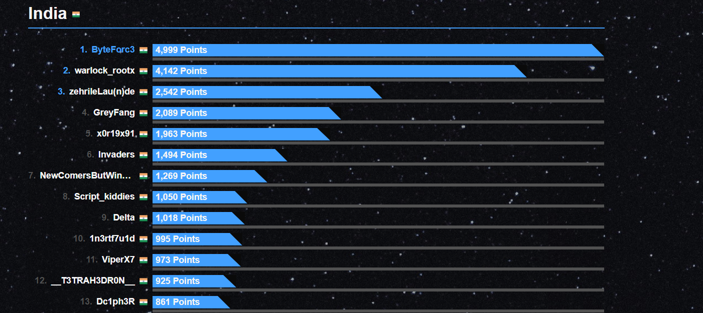
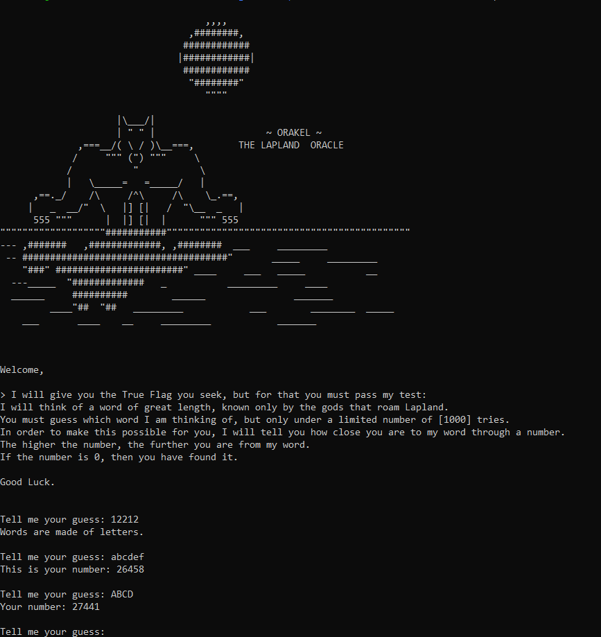
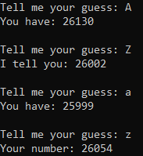
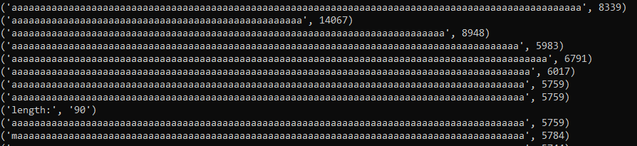
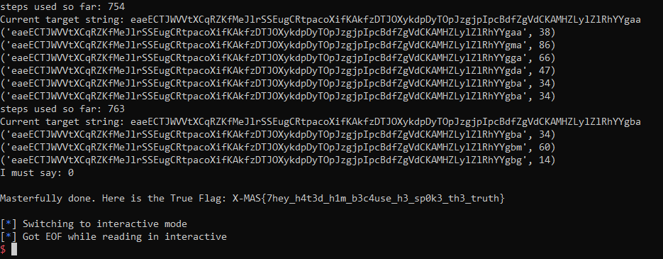

Hey guys back with another set of few writeups.

We did good and finished overall at 32nd in world and 1st in India.



# **PPC**

## Orakel-:
> description:

We have finally linked up with the famous Lapland Oracle, that knows and sees all!
Can you guess his secret word?

Remote server: challs.xmas.htsp.ro 13000

### Solution: 

When we connect to the server,we were greeted with this



We see that we can only send the alphabetic letters i.e [A-Z][a-z]. and for each string we get a number corresponding to it.
Sending random strings we get to know that it reaches a minima at certain length and that is random at each run.



The graph of function over value recieved at each character sent is not monotonic, its actually unimodal.
And on sending the correct composition of letters with the padding(to make the length required as expected) at end.Thus the perect searching algorithm to check each character at each run will be [ternary search](https://en.wikipedia.org/wiki/Ternary_search).


#### Several levels of optimization required:

So I tried to script it according to the algorithm as said here [ternary algo](https://cp-algorithms.com/num_methods/ternary_search.html) But that took around 80 chars right only out of 90 because of the complexity.

So contacting admin over this issue, he said there is also another version of ternary search that could help you with the better complexity. So after wandering around master's theorem I know, I'm using T(n)=T(2n/3) + 2  i.e. O(2\*log3(n)) and about that i can do better if i don't divide it into three parts rather dividing into just two parts and make the middle part 'void' . So that would make T(n)=T(n/2)+ 2 i.e. O(log2(n)). But that wasn't enough becuase of my algo procedure(that's my fault) . So after a bit of tinkering with minimizing the steps that I can use dictionary to not to send the same string again for evaluating function.

So that's the final [script](assets/opti_orakel.py) that will do the work:


```python
from pwn import *
import string
r=remote("challs.xmas.htsp.ro",13000)

r.recv()

char="a"               #for padding
l=1
h=200
length=0
steps=0
while l<h:
    mid1=(l+h)/2
    mid2=mid1+1
    r.sendline(mid1*char)
    key1=int(r.recv().split()[-5])
    r.sendline(mid2*char)
    key2=int(r.recv().split()[-5])
    steps+=2
    if(key1>key2):
        l=mid2
        print(mid2*char,key2)
        length=mid2
    else:
        h=mid1
        print(mid1*char,key1)
        length=mid1

print("length:",str(length))

dic={}
charset=sorted(string.letters)
flag="a"*length
for i in range(length):
    l=0
    h=len(charset)-1
    ans=0
    while l<h:
        mid1=(l+h)/2
        mid2=mid1+1

        c=charset[mid1]
        if(flag[:i]+c+flag[i+1:] in dic):
            key1=dic[flag[:i]+c+flag[i+1:]]
        else:
            r.sendline(flag[:i]+c+flag[i+1:])
            rec=r.recv()
            steps+=1
            if "MAS" in  rec:
                print(rec)
                r.interactive()
            else:
                key1=int(rec.split()[-5])
                dic[flag[:i]+c+flag[i+1:]]=key1

        d=charset[mid2]
        if(flag[:i]+d+flag[i+1:] in dic):
            key2=dic[flag[:i]+d+flag[i+1:]]
        else:
            r.sendline(flag[:i]+d+flag[i+1:])
            rec=r.recv()
            steps+=1
            if "MAS" in  rec:
                print(rec)
                r.interactive()
            else:
                key2=int(rec.split()[-5])
                dic[flag[:i]+d+flag[i+1:]]=key2
        if(key1>key2):
            print(flag[:i]+d+flag[i+1:],key2)
            l=mid2
            ans=mid2
        else:
            print(flag[:i]+c+flag[i+1:],key1)
            h=mid1
            ans=mid1
    flag=flag[:i]+charset[ans]+flag[i+1:]
    print("steps used so far: "+str(steps))
    print("Current target string: "+flag)


r.close()
```

Server response:


.............................................................................................

.............................................................................................


Full Response: [response](assets/response.txt)

Here is our flag:`X-MAS{7hey_h4t3d_h1m_b3c4use_h3_sp0k3_th3_truth}`


